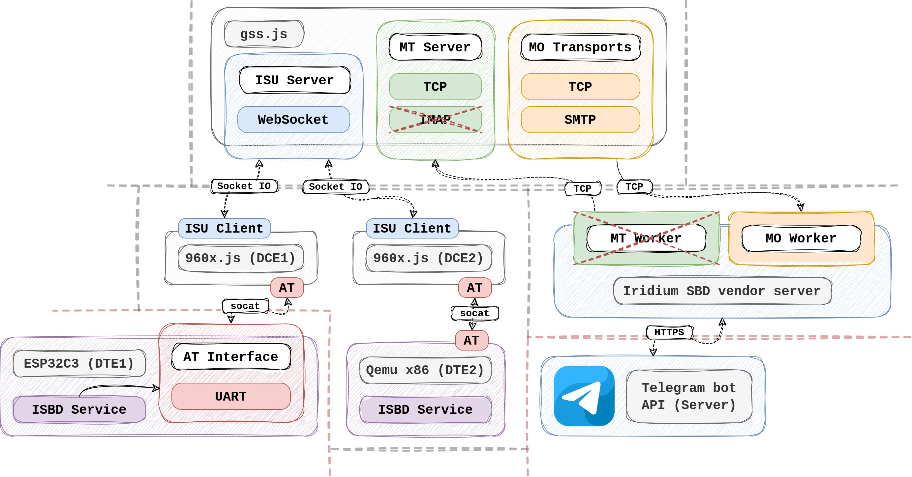

# Iridium SBD emulator 

This emulator has been developed in response to the lack of active emulators for Iridium SBD 960X and GSS. While there are a few repositories that provide a small Iridium SBD emulator, they are currently unmaintained and have not been updated in years. Furthermore, these implementations rely on outdated versions of Python and include incompatible dependencies.

This repository is still in its early stages, so you may find that some extra functionality is missing, if that's the case do not hesitate on requesting such functionality to be implemented by creating an issue. I'll do my best to address it as soon as possible. Any help or participation would be greatly appreciated.

> **NOTE**: this emulator does not emulate the behavior of a satellite network (at least by the moment), this is implicitly abstracted within the GSS.

The following image shows a simple deployment using the emulator:



This emulator also includes [some extra tools](#tools) that you may find useful during the development process.

# Index

- [Iridium SBD emulator ](#iridium-sbd-emulator-)
- [Index](#index)
- [Implementation](#implementation)
- [Building the emulator](#building-the-emulator)
- [Setting up the environment](#setting-up-the-environment)
- [Running the emulator](#running-the-emulator)
  - [Generating Google application passwords for SMTP](#generating-google-application-passwords-for-smtp)
  - [MO message sample](#mo-message-sample)
- [Tools](#tools)
  - [Encoder script](#encoder-script)
    - [Encoding MT messages](#encoding-mt-messages)
  - [Decoder script](#decoder-script)
  - [Transport script](#transport-script)
  - [Sending a MT message](#sending-a-mt-message)
- [General GSS behavior](#general-gss-behavior)


# Implementation

This emulator is written in [TypeScript](https://www.typescriptlang.org/) which is a strongly typed programming language that builds on JavaScript (NodeJS environment in this case).

The idea of this implementation is to be flexible in order to facilitate the process of adding new functionality to the emulator. Currently there are some limitations, multiple AT commands are not currently supported and in some cases only a subset of all possible error codes are used.

This emulator actually consists in two different programs: `960x.js` emulator and `gss.js` emulator, the first one allows you to instantiate an _Iridium SBD 960X_ like transceiver and the `gss.js` allows you to emulate an Iridium GSS "locally".

> **NOTE**: this emulator can be run in different machines, this means that you can run the `960x.js` emulator on a different machine from where the transceiver `960x.js` is running.

> **IMPORTANT**: if you use a _WAN_, remember that all the data travels over TCP or HTTP/TCP without TLS (like Iridium does).

The core of this emulator is also exposed in order to be reused for more specific implementations.

> **NOTE**: currently, there is no documentation available for core utils. Depending on how useful this emulator is for the community, I will consider adding extra documentation for that purpose. 

# Building the emulator
Before building this emulator you'll need to install `NodeJS` environment (which you probably have already installed) but in case you don't, you can simply do:

> **NOTE**: the following instructions assume you are working from Ubuntu. If you need specific instructions for your OS, search in Google how to install `Node JS v14.x`.

``` bash
curl -sL https://deb.nodesource.com/setup_14.x -o nodesource_setup.sh
```

If you don't feel comfortable with a direct "blind" install, please check the content:
``` bash
nano nodesource_setup.sh
```

Finally install it:
``` bash
sudo bash nodesource_setup.sh
```

If `node` and `npm` are accesible from your path, now you can build the entire project by going to the root of this repository and executing:
``` bash
npm i
```
Thats all. Now, the symlinks named `gss.js` and `960x.js` should be pointing to a valid JavaScript file inside the `build/` directory.

If you want to run those scripts simply tell `node` to execute them, like:
``` bash
node gss.js
```

For more details, see [how to run the emulator](#running-the-emulator).

# Setting up the environment
Apart from the emulator itself, this repository also includes additional _CLI_ tools as you'll see in the following sections, so, instead of having to specify the full path of the different scripts or making additional installation steps, you can use the `isbd-env.sh` script located in the root of this repository to load all required environment variables and bash completions. Use the following command to load the Iridium SBD environment:
``` bash
source isbd-env.sh
```

> **NOTE**: if you want to avoid to load the environment each time you open a new terminal, you can use `.bashrc` file located in the home directory of your current user and automatically load the Iridium SBD environment.

Now you should be able to execute things like:
``` bash
isbd gss --help
```

You can use autocomplete, for example, for the first arguments:
``` bash
$ isbd <tab><tab>
960x       decode     encode     gss        transport 
```

> **NOTE**: autocompletion is under development and does not support all possible command line arguments. 

Most of the command line samples showed in this `README` use the Iridium SBD environment wrapper.

# Running the emulator

If you want to see all the possible command line arguments of any script, simply append `--help` flag:
``` bash
isbd 960x --help
``` 

This (actually) results in:
``` txt
Usage: 960x [options]

A simple emulator for Iridium SBD 960X transceivers

Options:
  -V, --version        output the version number
  -p, --path <string>  serial port path
  -i, --imei <string>  set ISU IMEI (default: "527695889002193")
  --gss-host <string>  GSS Socket host (default: "localhost")
  --gss-port <string>  GSS Socket port (default: 10801)
  --gss-uri <string>   GSS Socket URI
  -h, --help           display help for command
```

To finally run the `960x.js` emulator you need to create a virtual serial port in order to communicate with it, you can use `socat` to achieve that:

``` bash
socat -dd pty,link=/tmp/tty,raw,echo=0 pty,link=/tmp/960x,raw,echo=0
```

Leave this executing in the foreground or in a different terminal. Now you can execute:
``` bash
isbd 960x -vvv -p /tmp/960x
```

You should see an output like:
``` txt
2023-04-28T18:16:57.373Z [ OK ] @ at-interface: AT Interface ready
```
Now you can communicate with it, using, for example, `minicom`:
``` bash
minicom -D /tmp/tty
```

Try to send the test `AT` command, if you want to see what you type, you have to enable echo by following one of this options:
  1. Using `minicom` local echo, press `Ctrl+A` and then `E`.
  2. Using native AT Hayes echo command, type `ATE1` and then press `Enter`.

Output example:
``` txt
Welcome to minicom 2.7.1

OPTIONS: I18n 
Compiled on Dec 23 2019, 02:06:26.
Port /tmp/qemu, 17:10:48

Press CTRL-A Z for help on special keys

at

OK
```

Now we have to start the _GSS_ in order to allow the modem to send (_MO_) and receive (_MT_) messages.
``` bash
isbd gss -vvv
``` 

This will output something like:
``` bash
2023-04-28T18:21:31.871Z [WARN] @ main: No MO transports defined 
2023-04-28T18:21:31.877Z [ OK ] @ isu-server: ISU server ready, port=10802 
2023-04-28T18:21:31.877Z [ OK ] @ mt-server: MT server ready, port=10800
```

If you are still running the `960x` program the _ISU_ will connect automatically to the _GSS_ (like if a satellite was reachable).

The warning says that there are no _MO_ (_Mobile Originated_) transports defined, this transports are used in order to allow the _GSS_ to retransmit _MO_ messages from the _ISUs_ (_Iridium Subscriber Units_) to the [vendor server application](https://glab.lromeraj.net/ucm/miot/tfm/iridium-sbd-server). To fix that, just specify at least one _MO_ transport.

This emulator **supports two types of _MO_ transports**: `TCP` and `SMTP` (same as Iridium). You can use one or both at the same time. Use `--help` to see all the available command line options for the _GSS_:
``` txt
Usage: gss [options]

A simple emulator for Iridium GSS

Options:
  -V, --version                output the version number
  -v, --verbose                Verbosity level
  --mo-smtp-host <string>      MO SMTP transport host
  --mo-smtp-port <number>      MO SMTP transport port (default: 25)
  --mo-smtp-user <string>      MO SMTP transport username
  --mo-smtp-password <string>  MO SMTP transport password
  --mo-smtp-to <string>        MO SMTP transport destination address
  --mo-tcp-host <string>       MO TCP transport host
  --mo-tcp-port <number>       MO TCP transport port (default: 10801)
  --mt-server-port <number>    MT server port (default: 10800)
  --mo-server-port <number>    MO server port (default: 10802)
  -h, --help                   display help for command
```

If you want to setup _MO_ transport as _SMTP_ you'll have to specify (at least): `--mo-smtp-host` and `--mo-smtp-user` options:
``` bash
isbd gss -vvv \
  --mo-smtp-host smtp.domain.com \
  --mo-smtp-user your@email.com
```
- If you don't specify a destination address with `--mo-smtp-to`, emails will be sent to the email used for identification (to you). In other words, by default `--mo-smtp-to` equals to `--mo-smtp-user`. 

- If you want to use Gmail's SMTP service refer to [this section](#generating-google-application-passwords-for-smtp).

If you want to use the _MO_ transport as _TCP_, you'll need a running instance of [Iridium Direct IP compatible server](https://glab.lromeraj.net/ucm/miot/tfm/iridium-sbd-server). The required option to enable _TCP_ transport is `--mo-tcp-host`, the port is `10801` by default. For example:
``` bash
isbd gss -vvv \
  --mo-tcp-host localhost \
  --mo-tcp-port 10801
```

## Generating Google application passwords for SMTP

Recently, [Google has disabled the option](https://www.google.com/settings/security/lesssecureapps) to allow less secure applications to have access to your account, this allowed to use your own personal password to give access to third-party apps which is not ideal. 

Currently you can achieve the same, but requires a few extra steps: 
1. You need to have enabled [two factor authentication](https://myaccount.google.com/signinoptions/two-step-verification).
2. And then you can generate an application password [from here](https://myaccount.google.com/apppasswords). Save the password somewhere because you will not be able to see it again.

Now you can execute the Iridium GSS using Gmail's _SMTP_:
``` bash
isbd gss -vvv \
  --mo-smtp-host smtp.gmail.com \
  --mo-smtp-user example@gmail.com \
  --mo-smtp-password XXXXXXXXXXXXXXXX
```
If the port is not specified, the default value `25` will be used, Gmail's _SMTP_ works on: `25`, `465` and `587` ports.

## MO message sample

If you want to manually send a simple _MO_ message for testing purposes, here you have an example on how to do that:
1. First make sure you have `socat`, `960x` and `gss` programs currently running.
2. Open serial monitor using `minicom`:
    ``` bash
    minicom -D /tmp/tty
    ```
3. In order to send your message, you have to first write it in the MO buffer of the ISU, using the following AT command:
    ``` bash
    AT+SBDWT=My awesome message
    ```
4. To send (or receive) messages you have to request a session with the Iridium GSS using the following AT command:
    ``` txt
    AT+SBDIX
    ```
5. If everything is set up correctly and the specified transports in the GSS are valid, you should receive the message previously sent over those transports. The log of the GSS program should look like:
    ``` txt
    2023-04-28T13:06:00.141Z [DBUG] @ gss: MO #0 sent from ISU 527695889002193
    2023-04-28T13:06:01.277Z [DBUG] @ gss: MO #1 sent from ISU 527695889002193
    ```

For further reference, [take a look to the Iridium 9602 SBD Transceiver Developer’s Guide](http://nearspace.ru/doc/Iridium-9602-SBD-Transceiver-Product-Developers-Guide.pdf).

> **NOTE**: some AT commands are not currently supported and you'll receive an `ERROR` response code in such cases.


# Tools
This emulator also includes additional _CLI_ tools which may result useful while developing applications. This tools consist in three different scripts:
  - [Encoder](#encoder-script) script which allows to encode Iridium Direct IP messages.
  - [Decoder](#decoder-script) script which allows to decode Iridium Direct IP messages.
  - [Transport](#transport-script) script which allows to send Iridium Direct IP messages.

## Encoder script

This script can be invoked like:
``` bash
isbd encode --help
```

Showing an output like:
``` txt
Usage: encode [options] [file]

Message encoder for Iridium SBD

Arguments:
  file           JSON message file

Options:
  -V, --version  output the version number
  -h, --help     display help for command
```

This script expects an input formatted in JSON, depending on the attributes of the given JSON it will detect if it is a _MO_ message or a _MT_ message.

### Encoding MT messages

If you want to encode a _MT_ message with payload you'll have to specify at least the header and the payload:
``` json 
{
  "header": {
    "imei": "527695889002193",
    "ucmid": [0,0,0,0],
    "flags": 0
  },
  "payload": {
    "payload": "Example message"
  }
}
```

Also, the payload can be defined using an array for arbitrary binary data, the array must contain bytes in decimal format, because JSON does not support hexadecimal format:
``` json 
{
  "header": {
    "imei": "527695889002193",
    "ucmid": [0,0,0,0],
    "flags": 0
  },
  "payload": {
    "payload": [ 
      69, 120, 97, 109, 112, 108, 101, 32, 109, 101, 115, 115, 97, 103, 101 
    ]
  }
}
```

> **NOTE**: you could think that the `payload` attribute is redundant, but this is due to the structure of the Iridium Direct IP protocol specification, each root attribute in the JSON are known as _IEs_ (Information Elements) which have some extra attributes that you don't have to specify here, those attributes will be filled automatically by the encoder. See [this manual](https://www.antrax.de/downloads/iridium-shield/quake-datasheets/iridium%20short%20burst%20data%20service%20developers%20guide%20v2%2001%20v1_0.pdf) if you want to know more about this.

Of course, you can specify only the header if you want to play with the flags attribute:
``` json 
{
  "header": {
    "imei": "527695889002193",
    "ucmid": [0,0,0,0],
    "flags": 1
  }
}
```
This message will flush the _MT_ message queue in the GSS.

> **NOTE**: Iridium SBD supports multiple flags, but this emulator supports (by the moment) only two flags: `1` and `2`.  
>   - `1` - Flush MT queue
>   - `2` - Send ring alert


## Decoder script

You can invoke to the decoder using the following command:
``` bash
isbd decoder --help
```

This will result in:
``` txt
Usage: decode [options] [file]

Message decoder for Iridium SBD

Arguments:
  file           SBD message file path

Options:
  -V, --version  output the version number
  --pretty       Output will be more human readable
  -h, --help     display help for command
```

If you want to decode a message, just give the binary file to the decoder and it will detect automatically if it is a _MT_ message or a _MO_ message.

The following command shows how to decode a _MT_ confirmation message:
``` bash
isbd decode MTC_527695889002193_13.sbd
```

This will result in something like:
``` txt
{"length":28,"rev":1,"confirmation":{"id":68,"length":25,"ucmid":[0,0,0,0],"imei":"527695889002193","autoid":13,"status":1}}
2023-05-02T21:41:53.083Z [ OK ] decoder main: Message successfully decoded 
```

If you want a more human readable output, use `--pretty` flag like:
``` bash
isbd decode MTC_527695889002193_13.sbd --pretty
```

This actually results in:
``` txt
{
	"length": 28,
	"rev": 1,
	"confirmation": {
		"id": 68,
		"length": 25,
		"ucmid": [
			0,
			0,
			0,
			0
		],
		"imei": "527695889002193",
		"autoid": 13,
		"status": 1
	}
}
2023-05-02T21:41:30.893Z [ OK ] decoder main: Message successfully decoded
```

## Transport script

This script will allow you to send _MT_ or _MO_ messages to a specific TCP server. You can invoke to this script using, for example:

``` bash
isbd transport --help
``` 

This will show you basic _CLI_ information:
``` txt
Usage: transport [options] [file]

Iridium SBD message transporter

Arguments:
  file                 SBD binary message file

Options:
  -V, --version        output the version number
  --tcp-host <string>  TCP transport host (default: "localhost")
  --tcp-port <number>  TCP transport port (default: 10800)
  -h, --help           display help for command
```

## Sending a MT message

Here we shoe you an example on how to send a _MT_ message to the Iridium GSS, the steps consists in:
  1. Encode a MT message from a file formatted in JSON
  2. Transport the MT message
  3. Decode the MT message transport confirmation

First create the JSON file:
``` json
{
  "header": {
    "imei": "527695889002193",
    "ucmid": [0,0,0,0],
    "flags": 0
  },
  "payload": {
    "payload": "Example message"
  }
}
```

Encode it:
``` bash
isbd encode mt.json > mt.sbd
```

Now send it using the transport script and save the confirmation message:
``` bash
isbd transport mt.sbd > mtc.sbd
```

Now decode the _MT_ confirmation message:
``` bash
isbd decode mtc.sbd --pretty
```

All of this steps can be unified in a one line version, because all the _CLI_ tools mentioned above, can be pipelined in order to redirect the input and output from each other. So here we show you a one line version of the previously mentioned steps:
``` bash
isbd encode mt.json | isbd transport | isbd decode --pretty
```
> **NOTE**: you can use this transport script directly with the official Iridium SBD Gateway, just make sure that the IP source in the packet that reaches Iridium's Gateway is properly whitelisted.

If all of the execution chain succeeds, you should see an output like the following:
``` txt
2023-05-02T21:55:16.945Z [ OK ] encoder main: MT message encoded 
2023-05-02T21:55:16.948Z [INFO] transport main: Sending MT message ... 
2023-05-02T21:55:16.953Z [ OK ] transport main: MT confirmation received
{
	"length": 28,
	"rev": 1,
	"confirmation": {
		"id": 68,
		"length": 25,
		"ucmid": [
			0,
			0,
			0,
			0
		],
		"imei": "527695889002193",
		"autoid": 1,
		"status": 0
	}
}
2023-05-02T21:55:16.957Z [ OK ] decoder main: Message successfully decoded 
```

# General GSS behavior

Here we'll describe how the Iridium SBD emulator operates depending on different conditions:

- When a _MO_ message reaches the GSS this message is queued and **will be sent over each defined transport**, if the message reaches it's destination over at least one transport it is considered as received by the vendor application, otherwise the message will be requeued, this is the expected original Iridium behavior.
- The emulator currently does not have any type of persistence and all data is volatile, when the program dies the information "disappears" with it. This will change in a near future.  